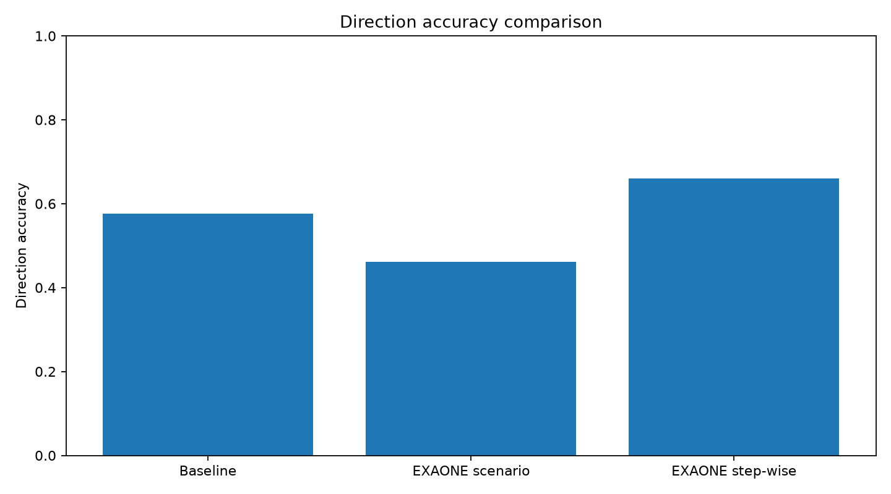
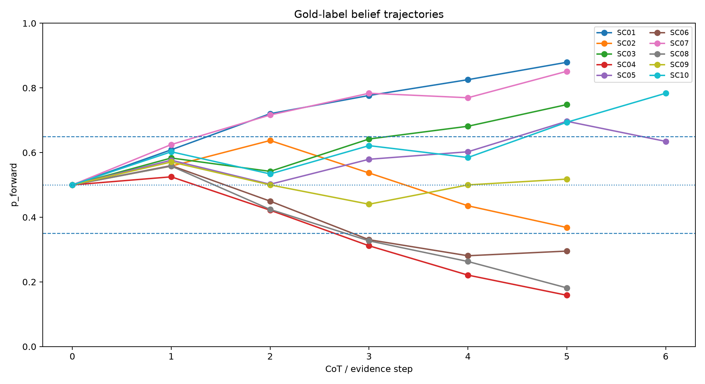
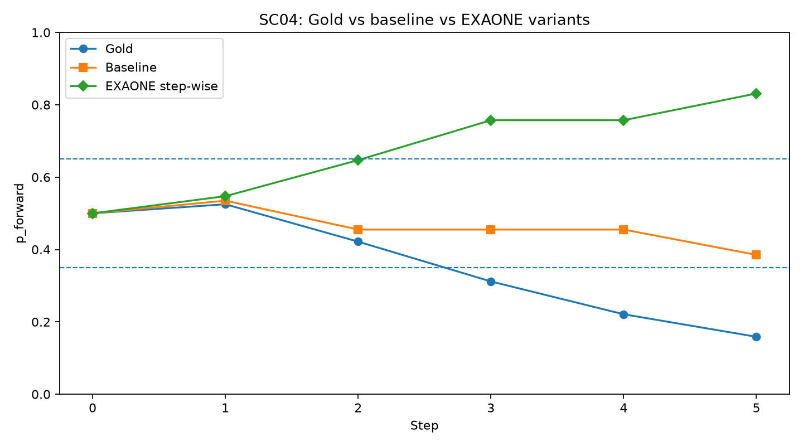
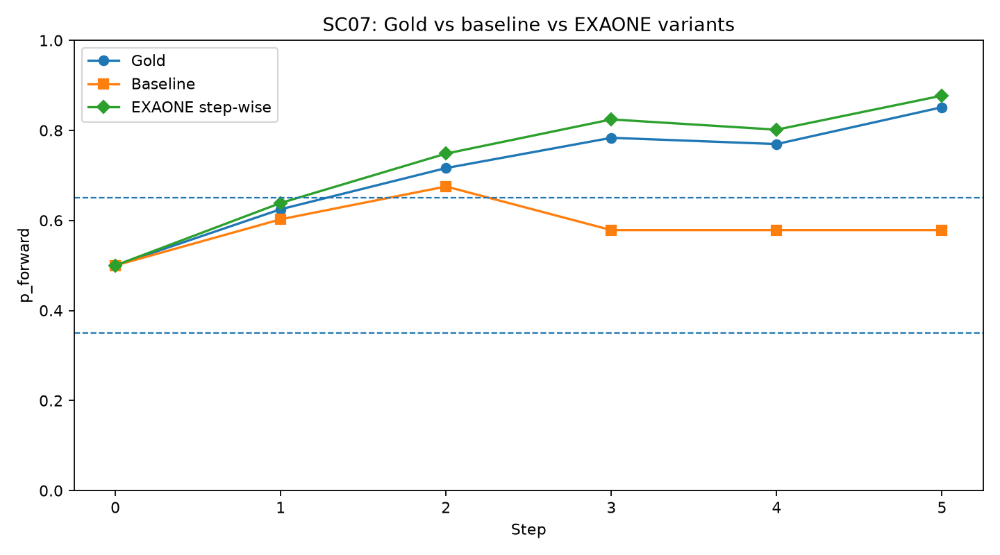
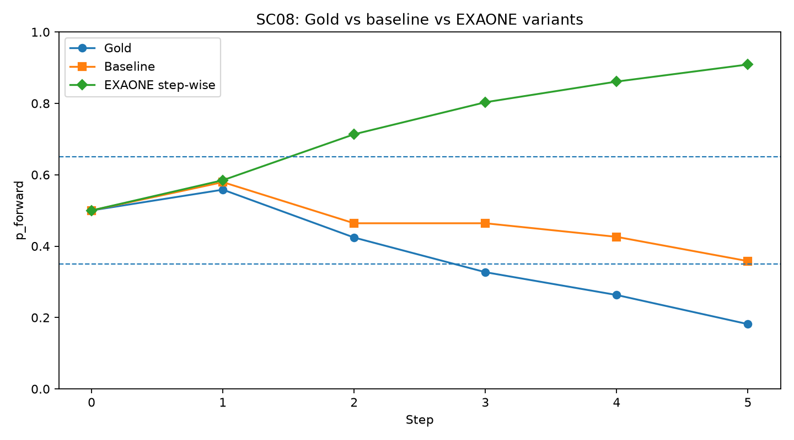

# TBG-CoT-Bench

**TBG-CoT-Bench** is a local application benchmark for testing temporal belief tracking over Chain-of-Thought-style evidence sequences.

The benchmark evaluates whether a system can track belief about the temporal claim:

> Event A occurred before Event B.

This repository contains synthetic temporal reasoning scenarios, rule-based baselines, local EXAONE/Ollama experiments, trajectory visualizations, generated reports, and pytest-based application benchmark checks.

---

## Current Status

```text
Application benchmark tests: 13 passed
Best current method: EXAONE step-wise evidence v2.1
```

The current best local method is **EXAONE step-wise evidence extraction v2.1**, which achieved stronger direction accuracy than the rule-based converter baseline while maintaining high structured-output parse stability.

---

## Main Results

| Method | Parse success rate | Direction accuracy | Notes |
|---|---:|---:|---|
| Rule-based baseline converter | N/A | 0.5769 | Deterministic converter using hand-written extraction rules. |
| EXAONE scenario-level CoT | Low / unstable | 0.4615 on parsed steps | Full-scenario prompting produced frequent JSON parse failures. |
| EXAONE step-wise evidence v2.1 | 0.9615 | 0.6600 | Best current local method; 50 / 52 steps parsed. |
| EXAONE order-classification v3 | 0.6154 | Unstable | High `UNCLEAR` collapse; directional accuracy is not directly comparable due to few directional parses. |
| EXAONE cumulative belief v4 | 0.4423 | Weak trajectory agreement | Conceptually close to belief tracking but less stable in the local setup. |

**Main interpretation:** step-wise structured evidence extraction is currently the most reliable local architecture for converting CoT-style temporal evidence into belief trajectories.

---

## Key Visualizations

### Stepwise EXAONE/Ollama vs Baseline



### Stepwise Parse Success


### Gold Belief Trajectories



### Stepwise EXAONE/Ollama Trajectories


---

## Scenario-Level Visualizations

| Scenario | Stepwise trajectory comparison |
|---|---|
| Scenario 01 |  |
| Scenario 02 |  |
| Scenario 03 |  |
| Scenario 04 |  |
| Scenario 05 |  |
| Scenario 06 |  |
| Scenario 07 |  |
| Scenario 08 |  |
| Scenario 09 |  |
| Scenario 10 |  |

---

## What This Repository Tests

This repository is an **application-level benchmark / usage test**, not a full internal unit test suite for the upstream `temporal-belief-graph` package.

It tests the following workflow:

```text
scenario JSON
→ evidence extraction
→ structured parsing
→ temporal belief trajectory update
→ evaluation
→ visualization
→ report generation
→ pytest validation
```

The goal is to check whether temporal evidence can be converted into a belief trajectory over the probability that Event A occurred before Event B.

---

## Compared Methods

The benchmark currently compares:

1. **Rule-based baseline converter**  
   A deterministic evidence converter using simple extraction rules.

2. **EXAONE scenario-level CoT**  
   The model receives a full scenario and returns all step judgments at once.

3. **EXAONE step-wise evidence v2.1**  
   The model receives one evidence item at a time and returns a structured judgment.

4. **EXAONE order-classification v3**  
   The model chooses between `A_BEFORE_B`, `B_BEFORE_A`, and `UNCLEAR`.

5. **EXAONE cumulative belief v4**  
   The model receives cumulative evidence and directly estimates the current temporal conclusion.

---

## Dataset Contents

| Directory | Description |
|---|---|
| `scenarios/` | Ten synthetic temporal belief tracking scenarios. |
| `results/` | Evaluation outputs, parsed evidence tables, trajectory CSVs, and summary metrics. |
| `figures/` | Static visualizations comparing gold trajectories, baseline conversion, and EXAONE/Ollama outputs. |
| `notebooks/` | Notebook for inspecting results and reproducing visualizations. |
| `reports/` | Markdown experiment report generated from local evaluation outputs. |
| `scripts/` | Evaluation, parsing, plotting, and local experiment scripts. |
| `tests/` | Application-level usage tests validating expected benchmark files and outputs. |

---

## Main Result Files

| File | Description |
|---|---|
| [`results/converter_eval_summary.csv`](results/converter_eval_summary.csv) | Baseline converter summary metrics. |
| [`results/stepwise_ollama_eval_summary.csv`](results/stepwise_ollama_eval_summary.csv) | Stepwise EXAONE/Ollama evaluation summary. |
| [`results/stepwise_ollama_scenario_summary.csv`](results/stepwise_ollama_scenario_summary.csv) | Scenario-level stepwise evaluation results. |
| [`results/order_v3_eval_summary.csv`](results/order_v3_eval_summary.csv) | Order-sensitive extraction evaluation summary. |
| [`results/cumulative_v4_eval_summary.csv`](results/cumulative_v4_eval_summary.csv) | Cumulative belief prediction evaluation summary. |
| [`results/trajectories_gold.csv`](results/trajectories_gold.csv) | Gold belief trajectories. |
| [`results/trajectories_auto.csv`](results/trajectories_auto.csv) | Rule-based baseline trajectories. |
| [`results/trajectories_stepwise_ollama.csv`](results/trajectories_stepwise_ollama.csv) | Stepwise EXAONE/Ollama belief trajectories. |
| [`results/ollama_stepwise_evidence_raw.jsonl`](results/ollama_stepwise_evidence_raw.jsonl) | Raw stepwise model outputs. |
| [`reports/tbg_cot_experiment_report.md`](reports/tbg_cot_experiment_report.md) | Generated markdown experiment report. |

---

## Repository Structure

```text
tbg-cot-bench/
├── scenarios/              # Temporal reasoning benchmark scenarios
├── scripts/                # Experiment, evaluation, visualization, and report scripts
├── results/                # CSV and JSONL experiment outputs
├── figures/                # Generated plots and comparison figures
├── notebooks/              # Result inspection notebook
├── reports/                # Markdown experiment reports
├── tests/                  # Application-level benchmark tests
├── pytest.ini
├── README.md
└── DATASET_CARD.md
```

---

## Notebook

The main inspection notebook is available here:

[`notebooks/tbg_cot_tracking.ipynb`](notebooks/tbg_cot_tracking.ipynb)

It can be used to inspect scenario files, load result CSVs, and reproduce trajectory-level visualizations.

---

## Requirements

This project was tested locally with:

```text
Ubuntu 22.04
Python virtual environment
Ollama
EXAONE local GGUF model via Ollama
pytest
matplotlib
```

Install basic Python dependencies:

```bash
pip install -r requirements.txt
```

Ollama should already have a local model registered, for example:

```bash
ollama list
```

Expected model name used in scripts:

```text
exaone-local
```

---

## Running the Benchmark

Activate the virtual environment from the project root:

```bash
cd ~/Desktop/CHMLabs/tbg-cot-bench-local-experiment
source ../venv/bin/activate
```

Run the current best EXAONE step-wise pipeline:

```bash
OLLAMA_MODEL=exaone-local bash scripts/run_stepwise_v21_pipeline.sh
```

Generate the experiment report:

```bash
python scripts/generate_experiment_report.py
```

Run application benchmark tests:

```bash
pytest
```

Expected result:

```text
13 passed
```

---

## Testing

The test suite validates the benchmark as a reproducible application-level experiment.

It checks:

```text
- scenario file structure
- required result files
- step-wise v2.1 performance against the baseline
- trajectory probability bounds
- report generation
```

Run:

```bash
pytest
```

Current validated result:

```text
13 passed
```

---

## Interpretation

The experiments suggest the following:

1. Scenario-level CoT prompting is unstable for local EXAONE in this setup.
2. Step-wise evidence extraction improves structured-output reliability.
3. Order classification can collapse into `UNCLEAR`.
4. Cumulative prompting can overload the local model and reduce parse stability.
5. The most reliable current architecture is modular:

```text
evidence extraction
→ structured parsing
→ belief update
→ trajectory evaluation
```

---

## Recommended Next Steps

Planned next steps:

```text
1. Freeze EXAONE step-wise v2.1 as the current best local method.
2. Expand scenarios with harder reversal and noisy convergence cases.
3. Add optional integration tests against the upstream temporal-belief-graph package.
4. Add a lightweight Hugging Face Space only if an interactive demo becomes necessary.
5. Package a stable release after scenario expansion.
```

---

## License

This dataset and its generated benchmark artifacts are released under **CC-BY-NC-4.0** unless otherwise specified.

The accompanying code may be relicensed separately depending on release intent.

Recommended code-side options:

```text
Apache-2.0 for research/tooling openness
AGPL-3.0 for stronger defensive sharing requirements
```

---

## Author

Created and maintained by **CHML-real**.

GitHub:

```text
https://github.com/CHML-real
```
